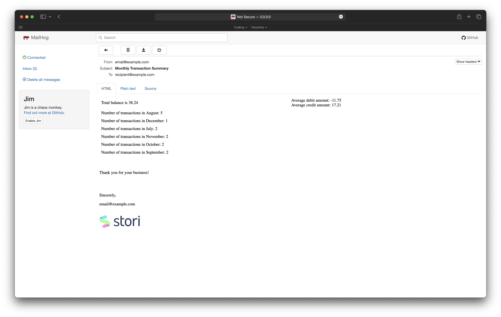

# Stori

---

<p
    align="center">
    
</p>

---

## How to execute

To initialize the services, `function`, `storage`, `smtp`, execute the following command,
it will start the container for mentioned services within the same network.

```bash
make run
```

The `endpoint` behaves like a `function` in Cloud, it triggers the process to read a file `txns.csv`
mounted in a separated container (to emulates Cloud Storage) to prepare a summary to be send via
email to a user. However, the content file can be retrieved via `cURL` for ease check.

```bash
curl http://localhost:9090/txns.csv
```

`txns.csv` can be updated at anytime, to remove or add new data. Then simply start again the container
with `make` command. The container is respawned without affecting other containers.

```bash
make storage
```

In this demo, the function name is `processor` and the `Go` binary generated is called `processorHandler`.
The `endpoint` (`http://localhost:8080/api/processor`) can be accessed via web browser or via `cURL`
request; in both cases the summary report is generated.

```bash
curl http://localhost:8080/api/processor
```

To connect to the Database (`MySQL`) access the database container with demo user and password. The
transsactions are stored after each time the CSV file is read. Notce that inserts are duplicates
since this demo is using the same `csv` file.

```sql
$ docker exec -it database /bin/bash
# mysql -u user -ppassword

mysql> show databases;
mysql> use demo_db;
mysql> select * from transactions;
+----+------+-------+-------------+
| id | user | month | transaction |
+----+------+-------+-------------+
|  1 | user | 7/15  |    60.50000 |
|  2 | user | 7/28  |   -10.30000 |
|  3 | user | 8/2   |   -20.46000 |
|  4 | user | 8/13  |    10.00000 |
```

After the request, an email with summary report is sent to `MailHog` server, this is the mock for
demostration so no user and password is required to configure the SMTP relay or user email account.
The mail UI is accessible via web browser `http://0.0.0.0:8025/`. The `MailHog` stores emails in
memory and they are erased after container restart.

The `endpoint` for emails is also reachable via `cURL`.

```bash
curl http://localhost:8025/api/v2/messages
```

## Design

```Mermaid
flowchart LR
    A[Function] --> B(Storage)
    A[Function] -->|Store txn| D[Database]
    B(Storage) -->|CSV content| A[Function]
    A[Function] --> C[SMTP]
    C[SMTP] --> |Send summary| E[User]
```

The systemm is intended to mock a Cloud environment, where a function is called to generate a
summary report that it's send to a final user. Each part, `function`, `storage`, `smtp`, is deployed
in a single container under the same network: `172.20.0.0/16`

`172.20.0.2` -> MailHog
`172.20.0.3` -> Storage
`172.20.0.4` -> Database
`172.20.0.5` -> Function

## References

* https://github.com/mailhog/MailHog/tree/master
* https://hub.docker.com/_/mysql
